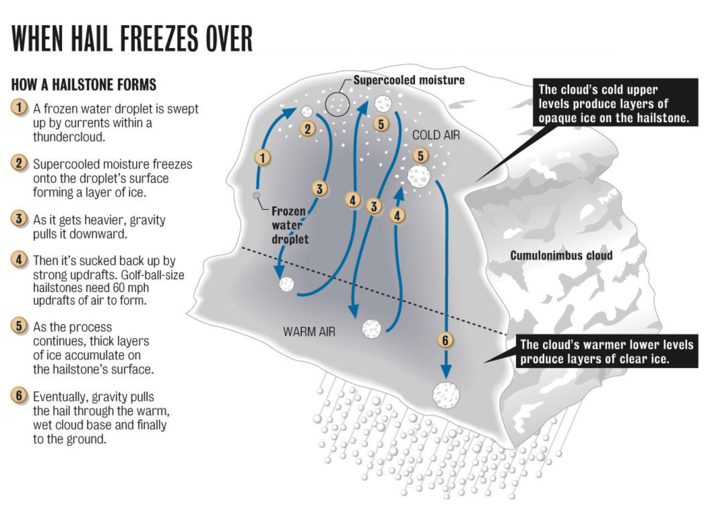
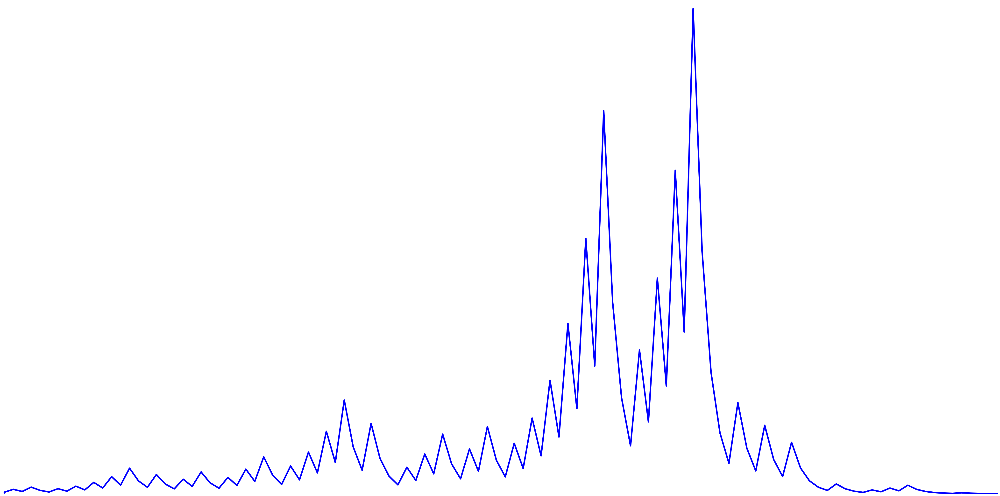
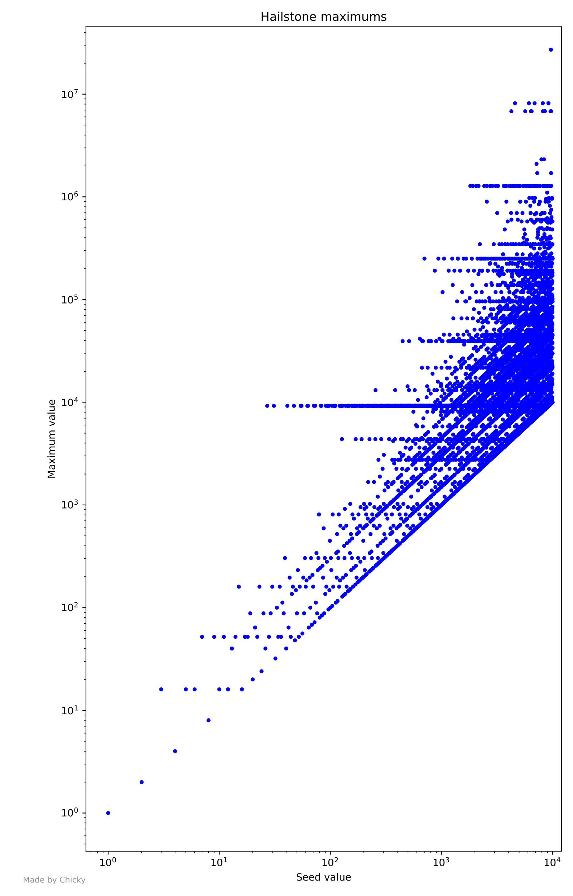
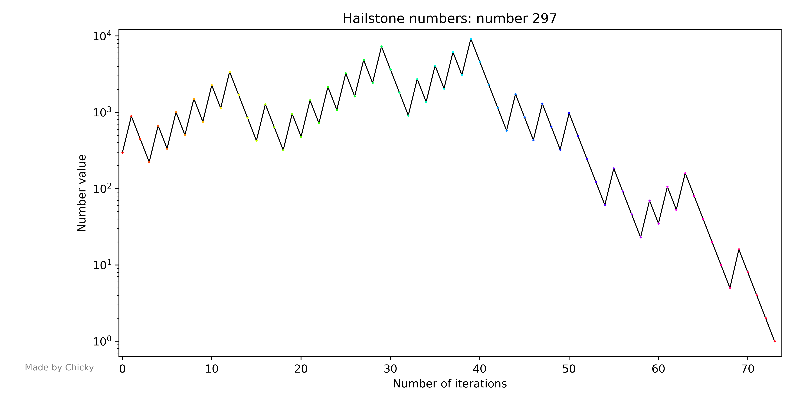
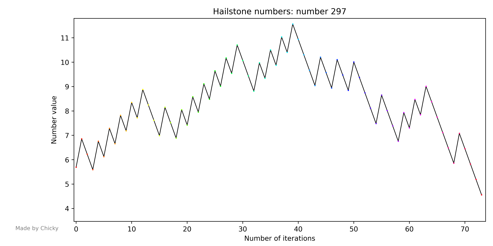
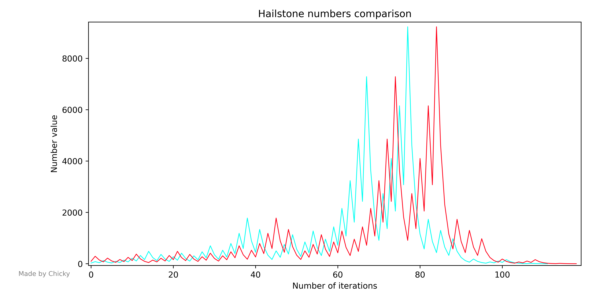
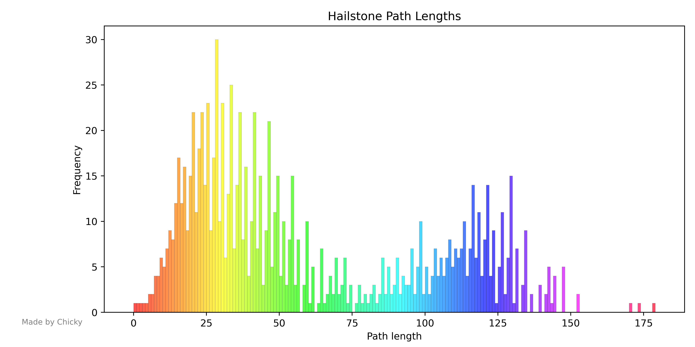
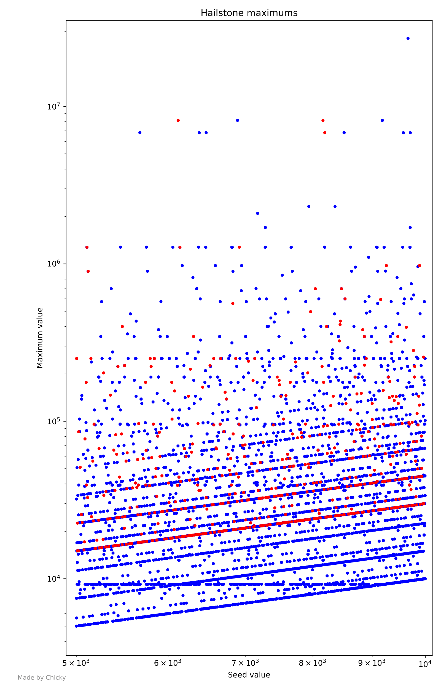
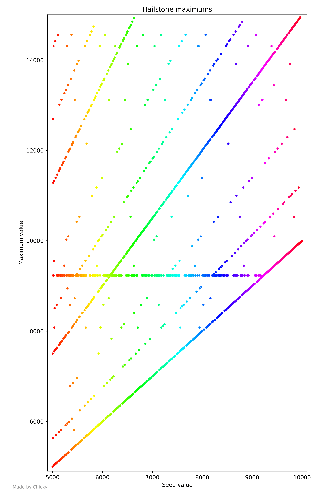
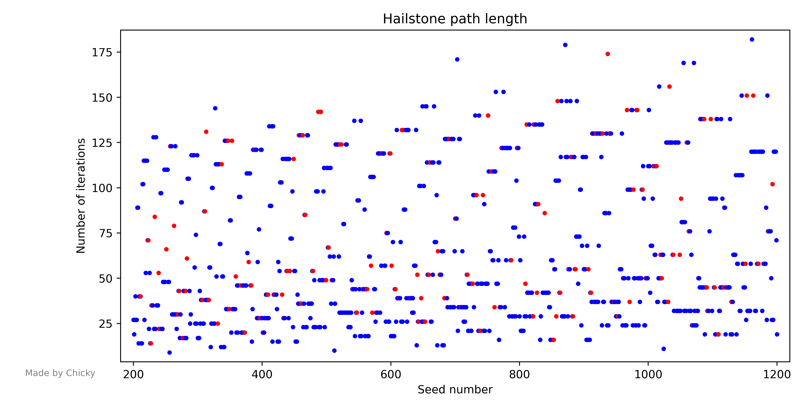

# Do you like Hailstones? 👀
Well, you're not alone! I also like hailstones, especially during stormchasing, because if you spot that nice green-hued hail core and don't leave immediately, your car windshield will get very nice spiderweb-like decorations 😶.  

On a more serious note, let's talk about a different type of hailstone 😄, to wit, the numerical kind! How do numbers relate to hailstones, you may ask? 
Good question. Let's find out!

If you may recall, hailstones form in the upper part of a cumulonimbus, where the temperature is below freezing. The hailstone starts as a raindrop that freezes into a tiny droplet, and slowly grows as it is being tossed around in the updraft of the storm in an up and down motion. And, when it gets too heavy, it falls from the cloud onto your windshield.  
  
Now that you've had this refresher, take a look at the following path below.  
  
Doesn't this resemble the path a hailstone could take while it forms? It sure does! At least, it sort of does!  

Now, you ask, what generated this path? Well, the path is just a connected sequence of numbers... Perhaps, you could call it a *hailstone* sequence, even? 😄 Indeed, the generator of this path is none other than the famous Collatz conjecture! 

In this project, I will be exploring exactly that - the Collatz conjecture. For those of you who don't know what this is, let's take a dive into it.  

# The Collatz Conjecture
The *Collatz Conjecture*, also known as the *3n+1* problem, is a famous unsolved mathematical puzzle that has intrigued mathematicians for decades, named after the German mathematician Lothar Collatz, who first proposed it in 1937. The conjecture can be simply summarized as follows:  

1. Start with any positive integer *n*.
2. If *n* is even, divide it by 2 to get *n/2*.
3. If *n* is odd, multiply it by 3 and add 1 to get *3n+1*.
4. Repeat the process indefinitely for the resulting numbers.

The Collatz Conjecture states that regardless of the initial value of *n*, this process will eventually reach *1*. More precisely, the process will eventually reach the cycle *4, 2, 1*, and continue indefinitely.  

Sounds simple right? Well, at its crux, the process the conjecture is based around may very well be simple! But, as math has it, no matter how simple the root process may seem, the whole problem is a completely different story. As it turns out, this is a very hard conjecture to prove. It's so hard, as a matter of fact, that even now as of 2023, nobody has been able to prove it, meaning it's still an open problem in mathematics!  

This isn't from a lack of trying either. Believe me when I tell you that people have brute forced numbers up to 268 and still haven't found a counterexample. That's a lot of numbers! Even Terence Tao, one of the most brilliant mathematicians of the 21st century, failed to prove it, though through his investigations, came quite close, being able to show that for "almost" every seed value, its Collatz sequence will eventually reach a value that is less than any well-behaved function that grows to infinity. The "almost" here means that as we take the ratio of seed values whose Collatz sequences don't reach a value that is less than a given well-behaved function that grows to infinity, versus those that do, this ratio approaches 0. Tao has remarked that "this is the closest anyone has come to proving the conjecture without actually proving it".  

Fascinating stuff! 

# The Project
Now that we've had a brief introduction to the Collatz conjecture, let's talk about the project in this repo. The purpose of this project is to allow anyone to explore and analyze the patterns of hailstone sequences visually, which perhaps, in a rare moment of enlightenment, may allow someone to solve it 👀. 🥴 Just kidding, this is probably extremely unlikley lmao. Regardless, the visualization provided by this project should be quite intruiging. Anyhow, let's get started!

## Dependencies
This project is a commandline python project, meaning you should have some form of terminal to run it, as well as python.   
For python libraries, numpy, matplotlib, and scikit-learn are required. You can simply install them by doing

    pip install -r requirements.txt

There is a very very noobishly built docker image for this project, so the requirements shouldn't be a problem. Also, ig I could also try building an executable, but it will be tricky because of the way the project is structured. We shall see, but I probably won't try it. You are welcome to lmao.

## Usage
Currently, the project is run from the source python file, and it is a commandline program. To begin, simply do

    python main.py

There are 5 possible flags, with 3 being optional, along with the help flag.

    Flag                                Description                                     Details

    -d, --driver                        Required.                                       This specifies which driver program you want to 
                                        Choose the driver program.                      run, with each option corresponding to a completely 
                                                                                        different program.

                                                                                        There are 4 options: 
                                                                                        1. hailstone   - hailstone path graph
                                                                                        2. lengthHisto - hailstone path length histogram
                                                                                        3. maxHeight   - max hailstone number scatterplot
                                                                                        4. sequenceLen - hailstone path length scatterplot
    

    -v, --version                       Required.                                       This specifies which version of the driver program 
                                        Choose the version of the                       you want to run. 
                                        driver program.
                                                                                        There are a fair bit of options. I will list all of
                                                                                        them out, before specifying which ones are value for 
                                                                                        each driver program:
                                                                                        1. many     - many plots
                                                                                        2. prime    - highlight primes
                                                                                        3. primeTop - highlight primes and put them on top
                                                                                        4. rainbow  - make plots rainbow colored
                                                                                        5. single   - a single plot
                                                                                        6. reg      - regular plot

                                                                                        The following are value for select driver programs:
                                                                                        1. hailstone   - prime, rainbow, primeTop,      many, single
                                                                                        2. lengthHisto - prime, rainbow,           reg               
                                                                                        3. maxHeight   - prime, rainbow, primeTop, reg               
                                                                                        4. sequenceLen - prime, rainbow, primeTop, reg               

                                                            
    -p, --plot                          Optional.                                       This specifies what the driver program should plot.
                                        Choose what to plot.                            You need to input a valid python expression for declaring
                                                                                        either a list or a number.

                                                                                        Here are possible ways to use this flag:
                                                                                        1. -p "list(range(a, b))"
                                                                                        2. -p "[a, b, c]"
                                                                                        3. -p "a" 

                                                                                        You may use 1. and 2. for any driver except hailstone-single.
                                                                                        You can only use 3. for hailstone-single.
                                                                                        
                                                                                        If absent, the driver program will plot the default plot.
                                                                                        Here are the default plots for each driver program:
                                                                                        1. hailstone (except single) - 'list(range(1, 27))'
                                                                                        2. hailstone-single          - '27'
                                                                                        3. lengthHisto               - 'list(range(1, 1001))'
                                                                                        4. maxHeight                 - 'list(range(1, 101))'
                                                                                        5. sequenceLen               - 'list(range(1, 101))'

    -l, --log                           Optional.                                       This specifies whether or not to use log scaling for your plot.
                                        Choose log scaling options.                     
                                                                                        There are 4 options:
                                                                                        1. 0 - no log scaling
                                                                                        2. 1 - log scaling on y axis
                                                                                        3. 2 - log scaling on both axes
                                                                                        4. 3 - plot with LinReg slope subtracted from log plot,
                                                                                               with no log scaling

                                                                                        Sometimes only select driver/driver versions have 
                                                                                        certain options. Here are the detauls:
                                                                                        1. hailstone (except single) - 0, 1, 2
                                                                                        2. hailstone-single          - 0, 1, 2, 3
                                                                                        3. lengthHisto               - none
                                                                                        4. maxHeight                 - 0, 1, 2
                                                                                        5. sequenceLen               - 0, 1, 2

                                                                                        If absent, the driver program will use the default choice.
                                                                                        Here are the default choices for each driver program:
                                                                                        1. hailstone   - 0
                                                                                        3. lengthHisto - none
                                                                                        4. maxHeight   - 1
                                                                                        5. sequenceLen - 0

    -ht, --height                       Optional.                                       This specifies the height of the plot.
                                        Choose the height of the plot.                  This option is only available for plots where both axes
                                                                                        are linear. Note that for the "-l 3" flag, despite there
                                                                                        being no log scaling on either axes, this option is absent.
                                                                                        Call the flag with the maximum number you want to be on the 
                                                                                        y axis, which will be the height of the plot.

                                                                                        This flag exists on all drivers except lengthHisto. If 
                                                                                        absent, a given driver program will use the largest number
                                                                                        on the y axis in the plot as the height.

    -h, --help                          Optional.                                       This prints out the help message, which is a short 
                                        Print the help message.                         description of any flags inputted with this command. 
                                                                                        If this flag is present, the program will not run.

    -t, --timeout                       Optional.                                       This is specifically here for the docker image. Becuase 
                                        Timeout the script.                             the main.py file exits after running, the docker container 
                                                                                        will exit as well. This flag is here to prevent that. 
                                                                                        To use this properly, run the docker container first with
                                                                                        this flag on some external terminal, which will timeout the
                                                                                        first instance of the script. This allows you to run additional
                                                                                        instances of the script without the container exiting.
                                                                                                                   

Hopefully that was clear enough. If not, I will provide some examples below.  

Say we want a regular plot of the maximum height of hailstone sequences for all seed values from 1 to 10000, with log scaling on both axes. We would do

    python main.py -d maxHeight -v reg -l 2 -p "list(range(1, 10001))"

  
If we want to plot a single hailstone sequence for the seed value 297, with log scaling on the y axis, we would do

    python main.py -d hailstone -v single -l 1 -p "297"

  
Plotting the same thing as above but with the logarithm plot's linear regression slope subtracted from it is simply done by

    python main.py -d hailstone -v single -l 3 -p "297"

  
Comparing the hailstone sequences of "27" and "97" with regular scaling and rainbow color can be done with the following command

    python main.py -d hailstone -v rainbow -p "[27, 97]"

  
If we want to make a rainbow hailstone sequence length histogram with the default plot, which is from 1 to 1000, we would do

    python main.py -d lengthHisto -v rainbow

  
Say we are interested in how the maximum values of seeds that are primes (we want the prime points to be visible and on top) behave, in particular from 5000 to 10000, with both axes being scaled logarithmically. We would do

    python main.py -d maxHeight -v primeTop -l 2 -p "list(range(5000, 10001))" 

  
If we want to view the same graph above but with a rainbow coloring, and a max height of 15000 (without log scaling on any axis), we would do

    python main.py -d maxHeight -v rainbow -l 0 -p "list(range(5000, 10001))" -ht 15000

  
If we want to see how the sequence lengths of seeds from 200 to 1200 behave with normal scaling and primes highlighted but not necessarily on top, we would do 

    python main.py -d sequenceLen -v prime -p "list(range(200, 1201))"

  

Please note that I did not do any error checking for the flags. If you input an invalid flag or argument for the flag, the program will most likely error out, but in the chance that it works, then 🥴 bruh. Just follow the above docs properly.  

You can find all the graphs produced by this program in the /generated/ folder from the root of the repo. Which driver/driver version produces which graph is detailed below.

    Driver                              Graph Produced

    hailstone (except single)           /generated/graph.png
    hailstone-single                    /generated/graph-single.png
    lengthHisto                         /generated/pathLen.png
    maxHeight                           /generated/maxgraph.pdf
    sequenceLen                         /generated/seedLen.png

Note that all driver programs except maxHeight will output a .png file. maxHeight will output a .pdf file because the scale of the graph is too large for matplotlib to put into a .png file.

# Closing Remarks
This program is very noobishly written so expect bugs ig. If you find them, please open an issue so I can try to fix it lmao. Regardless, I hope you have fun with this and find some interesting patterns in the data. You're also free to modify the code to your liking to do things like highlight certain types of numbers or whatnot. If you do, feel free to make a pull request to add to it.  

Cheers!
